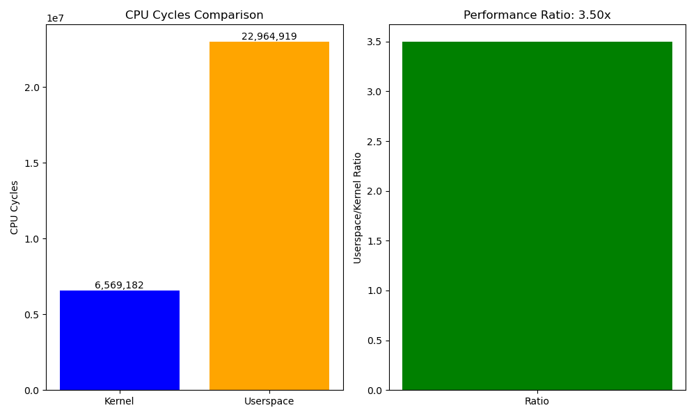

# Домашнее задание №4 «Решение задачи Читатель-Писатель в ядре и юзерспейсе"»

## Цель

Написать модуль ядра решающий задачу "Читатель-Писатель" с использованием kthread
и программу в userspace с использованием pthread;
сравнить их производительность.

## Задачи

* Написать Makefile с целями make, app_us, clean, load, unload, format и check.
* Написать модуль ядра использующий kthread и примитивы синхронизации, для
  реализации программы "Читатель-Писатель".
* Написать такую же программу с использованием pthread в us.
* Сравнить скорость выполнения программы (в циклах процессора) в ядре (perf record)
  и userspace (perf).

## Формат сдачи

Ссылка на GitHub репозиторий с проектом HW_04_kthread в проекте должен быть
Makefile, исходный код модуля и userspace программы.

## Критерии оценки

1. Makefile содержит цели: make, app_us, clean, load, unload, format и check.
2. Модуль собирается.
3. Модуль загружается.
4. Программа в userspace собирается.
5. Программа в userspace загружается.
6. Есть логи для perf в файле perf_app_us.log.
7. Есть флеймграф для модуля ядра flg_kern.html.

## Компетенции

1. Создание и управление модулями ядра:
    * уметь разрабатывать многопоточные модули и синхронизировать доступ к общим ресурсам.
2. Управление процессами и потоками:
    * уметь применять примитивы синхронизации для решения задачи читателей-писателей;
    * уметь выбирать оптимальный примитив под задачу;
    * знать архитектурные особенности реализации различных примитивов синхронизации и их применения в контексте производительности системы.

## Сборка и установка

Для постройки модулей используйте `make` и `sudo make install`. Далее загрузка
может выполняться командой modprobe.

Полный список команд `make`:

```
Available APP_USs:
  all              - Build all (default)
  clean            - Clean build artifacts
  format           - Format source code with clang-format
  format-python    - Format Python source code with black
  make             - Build rw kernel module
  app_us           - Build userspace app
  check            - Test all
  check-kern       - Test rw module
  check-us         - Test userspace app
  load             - Load rw module
  unload           - Unload rw module
  install          - Install module to system
  uninstall        - Remove module from system
  install-tools    - Install perf requirements
  perf             - Run perf tests
```

## Тесты

Для автоматизации проверок модулей написан скрипт в каталоге checker. Вызывается вручную командой `checker/main.py MODULE_TYPE MODULE_NAME`, например `sudo ./checker/main.py rw_kern rw_kern` или `sudo ./checker/main.py rw_us rw_us`.

Также можно использовать цели в Makefile'е (`sudo make check`).

Перед вызовом `sudo make perf` (выполняет сбор статистики производительности и построение флеймграфов)
рекомендуется установить требуемые пакеты через `sudo make install-tools`.

## Пример вывода perf

Пример вывода perf и флеймграфы приведены в [sample_perf_results](./sample_perf_results/).

Сравнение производительности kernel и userspace:

